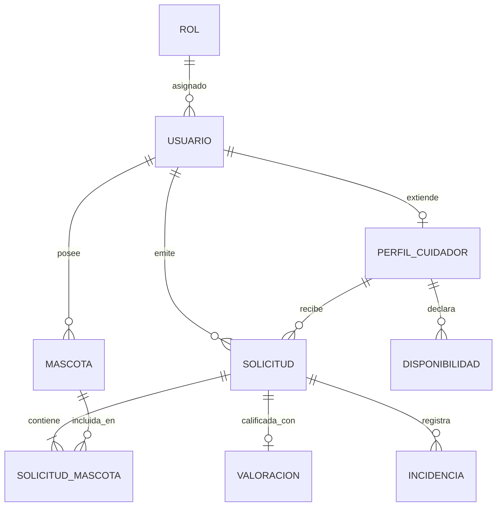

# Base de Datos | Cuidando Peluditos

En esta carpeta se encuentran los scripts formales de definición y manipulación de datos correspondientes a la **2.ª Entrega — Diseño y Módulos** de la Tecnicatura Universitaria en Programación a Distancia (TUPaD - UTN).

## Contenido de la carpeta
* `schema.sql`: Script DDL con la creación de tablas, claves foráneas, restricciones de integridad e índices para MySQL 8.x / MariaDB.
* `seeds.sql`: Script DML con la carga inicial obligatoria de roles (`DUENO`, `CUIDADOR`, `ADMIN`).

## Instrucciones de ejecución (MySQL CLI)
Para recrear la base de datos completa de forma manual, ejecutar desde la terminal:

```bash
mysql -u root -p -e "CREATE DATABASE IF NOT EXISTS cuidandopeluditos CHARACTER SET utf8mb4 COLLATE utf8mb4_unicode_ci;"
mysql -u root -p cuidandopeluditos < database/schema.sql
mysql -u root -p cuidandopeluditos < database/seeds.sql
```

## Diagrama Entidad-Relación (DER)
