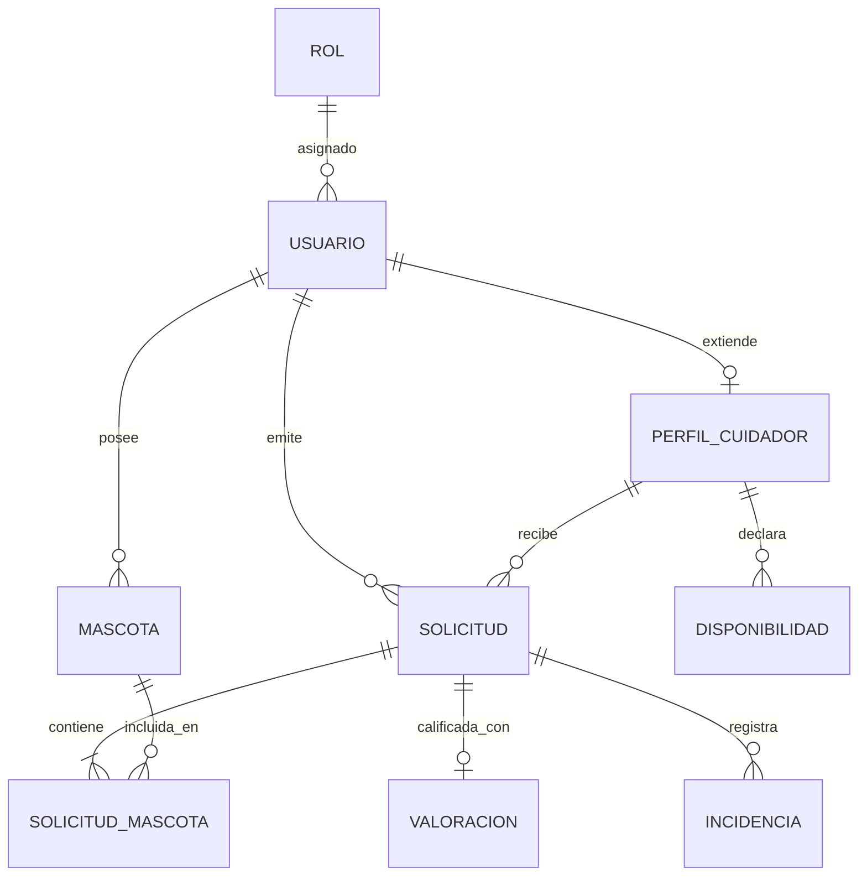

# Base de Datos | Cuidando Peluditos

En esta carpeta se encuentran los scripts formales de definición y manipulación de datos.

## Contenido de la carpeta
* `schema.sql`: Script DDL con la creación de tablas, claves foráneas, restricciones de integridad e indices.
* `seeds.sql`: Script DML con la carga inicial obligatoria de roles (`DUENO`, `CUIDADOR`, `ADMIN`).

## Instrucciones de ejecución
Para recrear la base de datos completa de forma manual, ejecutar desde la terminal:

```bash
mysql -u root -p -e "CREATE DATABASE IF NOT EXISTS cuidandopeluditos CHARACTER SET utf8mb4 COLLATE utf8mb4_unicode_ci;"
mysql -u root -p cuidandopeluditos < database/schema.sql
mysql -u root -p cuidandopeluditos < database/seeds.sql
```

## Diagrama Entidad-Relación (DER)

```mermaid
erDiagram
    ROL ||--o{ USUARIO : asignado
    USUARIO ||--o| PERFIL_CUIDADOR : extiende
    USUARIO ||--o{ MASCOTA : posee
    USUARIO ||--o{ SOLICITUD : emite
    PERFIL_CUIDADOR ||--o{ DISPONIBILIDAD : declara
    PERFIL_CUIDADOR ||--o{ SOLICITUD : recibe
    SOLICITUD ||--|{ SOLICITUD_MASCOTA : contiene
    MASCOTA ||--o{ SOLICITUD_MASCOTA : incluida_en
    SOLICITUD ||--o| VALORACION : calificada_con
    SOLICITUD ||--o{ INCIDENCIA : registra
```