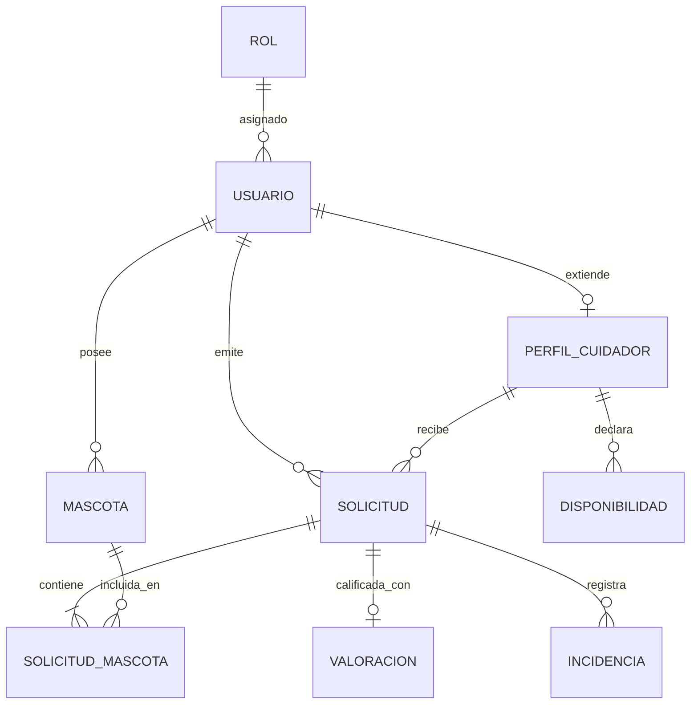

# Base de Datos | Cuidando Peluditos

En esta carpeta se encuentran los scripts para crear la estructura de la base de datos de **Cuidando Peluditos** y cargar los roles iniciales del sistema.

## Contenido de la carpeta
* `schema.sql`: Script de definición de datos (DDL) que crea las tablas, claves foráneas, restricciones de integridad e índices. Antes de crearlas, elimina las tablas existentes del proyecto y sus datos.
* `seeds.sql`:  Script de manipulación de datos (DML) que carga los roles iniciales (`DUENO`, `CUIDADOR`, `ADMIN`).


## Instrucciones de ejecución
Se requiere MySQL instalado, el servidor en funcionamiento y el comando `mysql` disponible en la terminal. El usuario debe tener permisos para crear la base de datos y sus tablas. Los ejemplos utilizan `root`; reemplazarlo si corresponde.

Ejecutar los comandos desde la raíz del repositorio y elegir la opción correspondiente a la terminal utilizada.

**Atención:** `schema.sql` elimina las tablas existentes del proyecto y sus datos antes de recrearlas. Utilizarlo únicamente en una base de desarrollo destinada a este proyecto.

### Opción 1: Bash

Ejecutar los siguientes comandos e ingresar la contraseña cuando se solicite:

```bash
mysql -u root -p -e "CREATE DATABASE IF NOT EXISTS cuidandopeluditos CHARACTER SET utf8mb4 COLLATE utf8mb4_unicode_ci;"
mysql -u root -p cuidandopeluditos < database/schema.sql
mysql -u root -p cuidandopeluditos < database/seeds.sql
```

Comprobar las tablas y los roles:

```bash
mysql -u root -p cuidandopeluditos -e "SHOW TABLES; SELECT id, nombre FROM roles;"
```

### Opción 2: PowerShell

Abrir el cliente de MySQL:

```powershell
mysql -u root -p
```

Ingresar la contraseña. Luego, ejecutar lo siguiente dentro del cliente de MySQL, identificado por el indicador `mysql>`:

```sql
CREATE DATABASE IF NOT EXISTS cuidandopeluditos
  CHARACTER SET utf8mb4
  COLLATE utf8mb4_unicode_ci;

USE cuidandopeluditos;

SOURCE database/schema.sql;
SOURCE database/seeds.sql;

SHOW TABLES;
SELECT id, nombre FROM roles;
```

Para salir del cliente:

```sql
EXIT;
```

### Resultado esperado

La consulta `SHOW TABLES` debe listar las nueve tablas del proyecto. La consulta sobre `roles` debe mostrar `DUENO`, `CUIDADOR` y `ADMIN`.

## Diagrama Entidad-Relación (DER)

```mermaid
erDiagram
    ROL ||--o{ USUARIO : asignado
    USUARIO ||--o| PERFIL_CUIDADOR : extiende
    USUARIO ||--o{ MASCOTA : posee
    USUARIO ||--o{ SOLICITUD : emite
    PERFIL_CUIDADOR ||--o{ DISPONIBILIDAD : declara
    PERFIL_CUIDADOR ||--o{ SOLICITUD : recibe
    SOLICITUD ||--|{ SOLICITUD_MASCOTA : contiene
    MASCOTA ||--o{ SOLICITUD_MASCOTA : incluida_en
    SOLICITUD ||--o| VALORACION : calificada_con
    SOLICITUD ||--o{ INCIDENCIA : registra
```