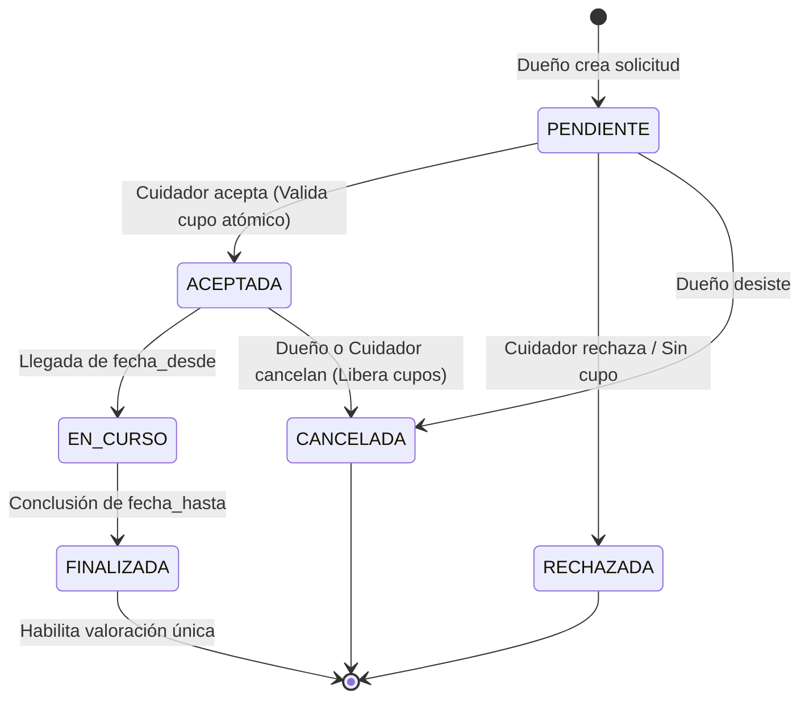
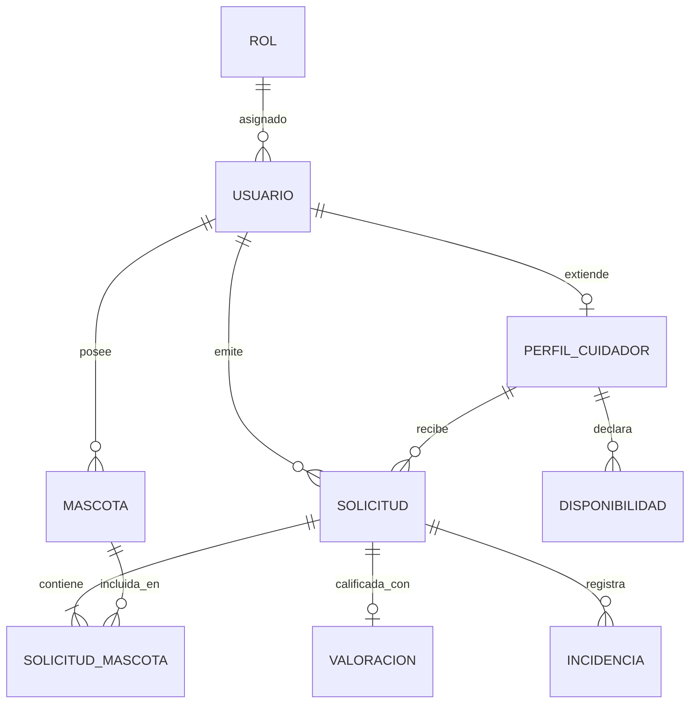

# TRABAJO INTEGRADOR FINAL | CUIDANDO PELUDITOS
**Carrera:** Tecnicatura Universitaria en Programación a Distancia (TUPaD) - UTN  
**Instancia:** 2.ª Entrega — Diseño y Módulos (Condición de Regular)  
**Grupo:** 176  
**Integrantes:** Macarena Aylen Marinoni | Marianela Paula Valletto  
**Docente Evaluador:** Oscar Londero  
**Fecha:** Septiembre 2026  

---

## 1. Introducción y Marco Curricular

El presente documento formaliza el diseño arquitectónico, el esquema relacional de datos y la organización modular del backend para la plataforma **Cuidando Peluditos**, atendiendo de manera directa a la devolución de la 1.ª Entrega.

El diseño se articula sobre las competencias adquiridas en el plan de estudios de la TUPaD:

* **Bases de Datos I y II:** Normalización en Tercera Forma Normal (3FN), restricciones de integridad referencial, transacciones ACID con bloqueo pesimista (`SELECT ... FOR UPDATE`) para prevenir sobreventas por concurrencia y versionado de esquema mediante migraciones controladas (Flask-Migrate).
* **Metodología de Sistemas I y II:** Arquitectura desacoplada basada en principios SOLID, patrones creacionales y de comportamiento, y formalización rigurosa de la máquina de estados de solicitudes.
* **Gestión de Desarrollo de Software:** Criterios de aceptación bajo sintaxis BDD (*Given / When / Then*), priorización bajo criterio INVEST y delimitación estricta de alcance (MVP).
* **Programación III y IV:** Implementación en Python y Flask mediante el patrón *Application Factory* y *Blueprints*, persistencia mapeada con Flask-SQLAlchemy y pruebas automáticas con Pytest.
* **Legislación (Ley N° 25.326):** Principio de minimización en datos de contacto y domicilios exactos, resguardando la privacidad durante la etapa de búsqueda pública.

---

## 2. Dominio Central y Reglas de Negocio

### 2.1. Disponibilidad y Modalidades en P0 (Fase 1)

* **Alojamiento:** Reserva por rango de fechas completas (`fecha_desde` a `fecha_hasta`). Cada cuidador define una `capacidad_maxima` entera que limita cuántas mascotas puede albergar simultáneamente en su domicilio.
* **Visitas a Domicilio:** Reserva puntual por día y franja horaria acordada en el domicilio del dueño.
* **Declaración de Condiciones de Convivencia:** El cuidador explicita en su perfil qué especies acepta, tamaños tolerados y compatibilidad con otros animales o niños, confirmando conscientemente la convivencia al aceptar cada solicitud.

### 2.2. Solicitudes Multi-Mascota del Mismo Dueño

Una única solicitud puede incorporar varias mascotas pertenecientes al mismo dueño. Cada animal individual seleccionado descuenta 1 plaza del cupo disponible del cuidador durante ese período.

### 2.3. Preservación Histórica e Inmutabilidad (Snapshot)

Los datos críticos de la mascota (nombre, especie, cuidados especiales, medicación y contacto de emergencia) se congelan en la entidad intermedia `SOLICITUD_MASCOTA` al momento de crearse la solicitud. Las modificaciones posteriores que el dueño realice en el perfil de su mascota no alterarán los antecedentes de servicios históricos.

### 2.4. Protocolo ante Imprevistos e Incidencias

Toda solicitud aceptada debe contener de forma obligatoria un contacto de emergencia secundario, veterinario de cabecera y autorización expresa del dueño para traslados de urgencia con límite de gastos preautorizado. Las anomalías durante el servicio se asientan en la entidad `INCIDENCIA` garantizando trazabilidad y auditoría.

### 2.5. Concurrencia y Bloqueo de Cupo

La verificación de vacantes se realiza dentro de una transacción en backend con bloqueo de lectura/escritura (`with_for_update()`), asegurando que dos solicitudes aceptadas casi simultáneamente no superen la capacidad declarada del cuidador.

### 2.6. Valoraciones Verificadas

Se restringe la emisión de reseñas y calificaciones exclusivamente al dueño vinculado al servicio, una única vez por solicitud (`UNIQUE`), y únicamente tras alcanzar el estado `FINALIZADA`.

## 3. Máquina de Estados de la Solicitud

## 4. Esquema de Base de Datos Relacional (DER)

### 4.1. Diccionario de Datos y Restricciones de Integridad

| Tabla | Clave Primaria | Claves Foráneas | Atributos Principales y Restricciones |
| :--- | :--- | :--- | :--- |
| **ROL** | `id` (INT) | - | `nombre` (VARCHAR(30), UNIQUE: 'DUENO', 'CUIDADOR', 'ADMIN') |
| **USUARIO** | `id` (INT) | `rol_id` &rarr; ROL(`id`) | `email` (VARCHAR(120), UNIQUE), `password_hash`, `nombre`, `apellido`, `telefono`, `provincia`, `localidad`, `direccion` (privada), `activo` (BOOL) |
| **PERFIL_CUIDADOR** | `id` (INT) | `usuario_id` &rarr; USUARIO(`id`) [UNIQUE] | `descripcion` (TEXT), `capacidad_maxima` (INT), `admite_perros` (BOOL), `admite_gatos` (BOOL), `condiciones_convivencia` (TEXT), `tarifa_diaria` (DECIMAL) |
| **MASCOTA** | `id` (INT) | `dueno_id` &rarr; USUARIO(`id`) | `nombre` (VARCHAR(50)), `especie`, `raza`, `tamano`, `fecha_nacimiento`, `cuidados_especiales` (TEXT), `contacto_veterinario`, `activo` (BOOL) |
| **DISPONIBILIDAD** | `id` (INT) | `cuidador_id` &rarr; PERFIL_CUIDADOR(`id`) | `fecha_desde` (DATE), `fecha_hasta` (DATE), `modalidad` (VARCHAR(20)), `activo` (BOOL) |
| **SOLICITUD** | `id` (INT) | `dueno_id` &rarr; USUARIO(`id`), `cuidador_id` &rarr; PERFIL_CUIDADOR(`id`) | `modalidad`, `fecha_desde`, `fecha_hasta`, `estado` (VARCHAR(20)), `total_mascotas` (INT), `monto_total` (DECIMAL), `contacto_emergencia`, `veterinario_emergencia`, `autorizacion_urgencia` (BOOL) |
| **SOLICITUD_MASCOTA** | `id` (INT) | `solicitud_id` &rarr; SOLICITUD(`id`), `mascota_id` &rarr; MASCOTA(`id`) | `nombre_snapshot`, `especie_snapshot`, `cuidados_snapshot` (TEXT) &mdash; *Preserva historial inmutable* |
| **VALORACION** | `id` (INT) | `solicitud_id` &rarr; SOLICITUD(`id`) [UNIQUE], `dueno_id`, `cuidador_id` | `puntaje` (TINYINT CHECK: 1 a 5), `comentario` (TEXT), `fecha_creacion` (DATETIME) |
| **INCIDENCIA** | `id` (INT) | `solicitud_id` &rarr; SOLICITUD(`id`), `reportado_por_id` &rarr; USUARIO(`id`) | `tipo` (VARCHAR(30)), `descripcion` (TEXT), `medidas_tomadas` (TEXT), `estado` (VARCHAR(20)), `fecha_registro` (DATETIME) |

### 4.2. Diagrama Entidad-Relación

## 5. Estructura Modular del Repositorio (Flask)

Se adopta una arquitectura en capas desacopladas mediante el patrón *Application Factory* y *Blueprints* de Flask:

<pre style="background: #f8fafc; border: 1px solid #cbd5e0; padding: 12px; font-family: 'Courier New', Courier, monospace; font-size: 11px; line-height: 1.45; white-space: pre; border-radius: 4px;">
TUPaD_CuidandoPeluditos_ProyFinal/
├── app/
│   ├── __init__.py               # Application Factory: create_app()
│   ├── config.py                 # Entornos de desarrollo, testing y producción
│   ├── extensions.py             # Instancias de db (SQLAlchemy), migrate y login_manager
│   ├── models/                   # Capa de entidades ORM (Persistencia)
│   │   ├── __init__.py
│   │   ├── usuario.py            # Modelos Usuario y Rol
│   │   ├── perfil_cuidador.py    # Modelos PerfilCuidador y Disponibilidad
│   │   ├── mascota.py            # Modelo Mascota
│   │   ├── solicitud.py          # Modelos Solicitud y SolicitudMascota (snapshot)
│   │   ├── valoracion.py         # Modelo Valoracion
│   │   └── incidencia.py         # Modelo Incidencia
│   └── modules/                  # Blueprints (Controladores, Formularios y Servicios)
│       ├── auth/                 # Registro, login, logout y sesiones seguras
│       │   ├── routes.py
│       │   ├── forms.py
│       │   └── services.py
│       ├── mascotas/             # CRUD y validaciones sanitarias de mascotas
│       │   ├── routes.py
│       │   ├── forms.py
│       │   └── services.py
│       ├── cuidadores/           # Perfiles públicos, tarifas y agenda de disponibilidad
│       │   ├── routes.py
│       │   ├── forms.py
│       │   └── services.py
│       ├── solicitudes/          # Máquina de estados y verificación atómica de cupos
│       │   ├── routes.py
│       │   ├── forms.py
│       │   └── services.py       # Transacciones con bloqueo pesimista
│       ├── valoraciones/         # Gestión de calificaciones de servicios finalizados
│       │   ├── routes.py
│       │   └── services.py
│       └── incidencias/          # Reporte, registro y seguimiento de imprevistos
│           ├── routes.py
│           └── services.py
├── docs/                         # Documentación formal académica
│   ├── Marinoni-Valletto_G176_Entrega01.md
│   └── Marinoni-Valletto_G176_Entrega02.md
├── tests/                        # Suite de pruebas automatizadas (Pytest)
│   ├── conftest.py               # Fixtures de base de datos en memoria y clientes HTTP
│   ├── test_disponibilidad.py    # Pruebas de reglas de agenda y solapamiento
│   └── test_concurrencia.py      # Pruebas de aceptación simultánea y saturación de cupos
├── requirements.txt              # Dependencias fijadas (Flask, SQLAlchemy, Pytest, etc.)
└── run.py                        # Punto de entrada para ejecución del servidor
</pre>

## 6. Modelado del Escenario de Prueba Integral

A continuación se especifica paso a paso el caso de uso complejo solicitado en la devolución docente, validando la integridad del modelo frente a condiciones de concurrencia y cambios de estado:

### Paso 1: Estado Inicial de Disponibilidad
El Cuidador C1 declara disponibilidad para el período comprendido entre el 10/10 y el 15/10 con una capacidad máxima simultánea de 2 mascotas (`capacidad_maxima = 2`) bajo la modalidad Alojamiento.

### Paso 2: Solicitud Multi-Mascota del Dueño D1
El Dueño D1 genera una solicitud de reserva para sus dos perros (M1 y M2) para el rango completo del 10/10 al 15/10.  
* **Estado:** `PENDIENTE`.  
* **Total mascotas:** 2 plazas solicitadas.

### Paso 3: Solicitud Concurrente del Dueño D2
Casi en simultáneo, el Dueño D2 emite una solicitud para su perro (M3) dirigida al mismo Cuidador C1 y para idéntico período (10/10 al 15/10).  
* **Estado:** `PENDIENTE`.  
* **Total mascotas:** 1 plaza solicitada.

### Paso 4: Aceptación y Reserva de Capacidad
El Cuidador C1 acepta la solicitud del Dueño D1. El backend ejecuta la transacción con bloqueo pesimista, comprueba que el cupo libre es suficiente (0 ocupadas + 2 solicitadas <= 2 plazas de capacidad máxima), actualiza el estado a `ACEPTADA` y confirma el compromiso de las 2 vacantes para esas fechas.

### Paso 5: Detección de Incompatibilidad por Sobrecupo
Al intentar evaluar o aceptar la solicitud pendiente del Dueño D2, el backend ejecuta la verificación transaccional y calcula que el cupo ocupado actual (2) más el solicitado (1) excede la capacidad máxima del cuidador (3 > 2). La transacción se aborta atómicamente, impidiendo la sobreventa (*overbooking*) y notificando al usuario la falta de cupo disponible.

### Paso 6: Cancelación y Liberación Dinámica
Con 48 horas de antelación al inicio del servicio, el Dueño D1 cancela su reserva por razones personales de fuerza mayor.  
* **Transición de estado:** `ACEPTADA` &rarr; `CANCELADA`.  
* **Efecto colateral en base de datos:** El sistema recalcula y libera automáticamente las 2 plazas reservadas en la agenda del Cuidador C1, restituyendo la disponibilidad para ese rango de fechas.

### Paso 7: Finalización del Servicio y Emisión de Valoración
En paralelo, un servicio previo acordado entre el Dueño D3 y el Cuidador C1 concluye su ciclo regular al cumplirse la fecha pactada.  
* **Transición de estado:** `EN_CURSO` &rarr; `FINALIZADA`.  
* **Efecto de negocio:** El sistema habilita de forma exclusiva al Dueño D3 para emitir una única valoración con puntaje (1 a 5) y comentario cualitativo, quedando registrada y vinculada unívocamente a dicha solicitud.
