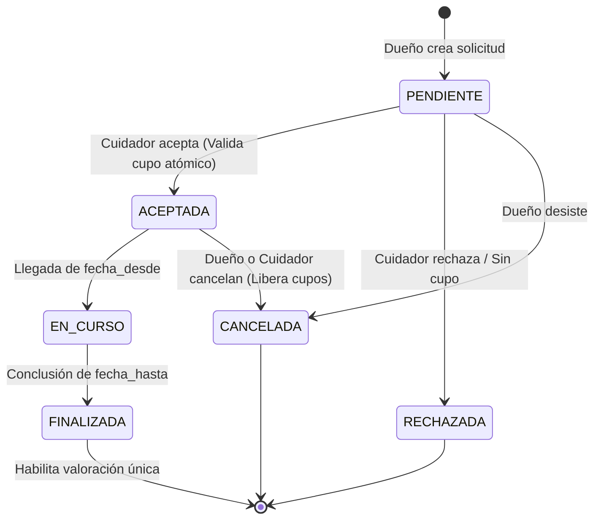
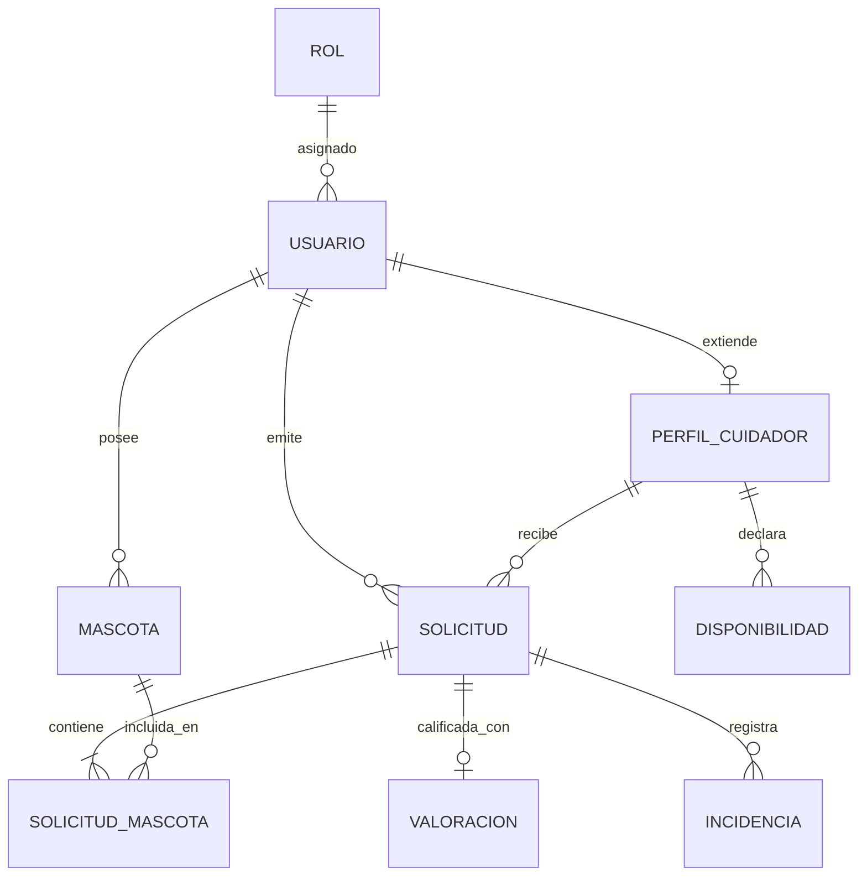

<link rel="stylesheet" href="estilos.css">

   
<h1>UNIVERSIDAD TECNOLOGICA NACIONAL</h1>
<h2>Entrega 2 - Diseño y Módulos</h2>

     

<strong>Grupo 176</strong>

Valletto, Marianela &lt;maruvalletto@gmail.com&gt;

Marinoni, Macarena &lt;marinonimacarena@gmail.com&gt;

     

Tecnicatura Universitaria en Programación

Trabajo final de carrera

     

<strong>Tutor: </strong>Londero, Oscar

27/09/2026

   

## ÍNDICE

- [ÍNDICE](#índice)
- [Parte 1: Introducción y marco curricular](#parte-1-introducción-y-marco-curricular)
- [Parte 2: Dominio central y Reglas de Negocio](#parte-2-dominio-central-y-reglas-de-negocio)
  - [2.1. Disponibilidad y Modalidades en P0 (Fase 1)](#21-disponibilidad-y-modalidades-en-p0-fase-1)
  - [2.2. Solicitudes Multi-mascota del mismo dueño](#22-solicitudes-multi-mascota-del-mismo-dueño)
  - [2.3. Preservación histórica e inmutabilidad (Snapshot)](#23-preservación-histórica-e-inmutabilidad-snapshot)
  - [2.4. Protocolo ante imprevistos e incidencias](#24-protocolo-ante-imprevistos-e-incidencias)
  - [2.5. Concurrencia y bloqueo atómico de cupo](#25-concurrencia-y-bloqueo-atómico-de-cupo)
  - [2.6. Sistema de valoraciones verificadas](#26-sistema-de-valoraciones-verificadas)
- [Parte 3: Máquina de estados de la solicitud](#parte-3-máquina-de-estados-de-la-solicitud)
  - [Matriz de transiciones de estado](#matriz-de-transiciones-de-estado)
- [Parte 4: Esquema de Base de datos relacional (DER)](#parte-4-esquema-de-base-de-datos-relacional-der)
  - [4.1. Diccionario de datos y restricciones de integridad](#41-diccionario-de-datos-y-restricciones-de-integridad)
  - [4.2. Diagrama Entidad-Relación](#42-diagrama-entidad-relación)
- [Parte 5: Listado de módulos funcionales a desarrollar](#parte-5-listado-de-módulos-funcionales-a-desarrollar)
- [Parte 6: Arquitectura modular del repositorio](#parte-6-arquitectura-modular-del-repositorio)
- [Parte 7: Modelado del escenario de prueba integral](#parte-7-modelado-del-escenario-de-prueba-integral)
  - [Paso 1: Estado inicial de disponibilidad](#paso-1-estado-inicial-de-disponibilidad)
  - [Paso 2: Solicitud Multi-mascota del Dueño D1](#paso-2-solicitud-multi-mascota-del-dueño-d1)
  - [Paso 3: Solicitud concurrente del dueño D2](#paso-3-solicitud-concurrente-del-dueño-d2)
  - [Paso 4: Aceptación y reserva de capacidad](#paso-4-aceptación-y-reserva-de-capacidad)
  - [Paso 5: Detección de incompatibilidad por sobrecupo](#paso-5-detección-de-incompatibilidad-por-sobrecupo)
  - [Paso 6: Cancelación y liberación dinámica](#paso-6-cancelación-y-liberación-dinámica)
  - [Paso 7: Finalización del servicio y emisión de valoración](#paso-7-finalización-del-servicio-y-emisión-de-valoración)
- [Parte 8: Repositorio del proyecto](#parte-8-repositorio-del-proyecto)

## Parte 1: Introducción y marco curricular

El presente documento formaliza el diseño, el esquema relacional de datos y la organización modular para la plataforma **Cuidando Peluditos**.

El diseño técnico se encuentra estrictamente fundamentado en las competencias y contenidos adquiridos en el plan de estudios de la carrera:

* **Bases de Datos I y II:** Normalización en Tercera Forma Normal (3FN), asegurando integridad referencial estricta mediante claves foráneas y restricciones de unicidad. Implementación de transacciones bajo estándar ACID con bloqueo pesimista (`SELECT ... FOR UPDATE`) para prevenir condiciones de carrera (*race conditions*) en la reserva concurrente de cupos. Estrategia de indexación B-Tree en atributos de búsqueda y filtrado frecuente (`email`, `localidad`, fechas y estados) y control de evolución de esquema con Flask-Migrate / Alembic.
* **Metodología de Sistemas I y II:** Arquitectura desacoplada basada en principios SOLID (especialmente Responsabilidad Única e Inversión de Dependencias en la capa de servicios de dominio), Clean Code, patrones creacionales y de comportamiento, y formalización rigurosa de una máquina de estados finitos que rige el ciclo de vida de cada contratación.
* **Gestión de Desarrollo de Software:** Criterios de aceptación bajo sintaxis BDD (*Given / When / Then*), historias de usuario priorizadas bajo criterio INVEST y delimitación rigurosa del alcance para mitigar el riesgo de *scope creep*.
* **Programación III y IV:** Implementación en Python y Flask mediante el patrón *Application Factory* y *Blueprints*, desacoplando rutas, lógica de negocio y persistencia ORM (Flask-SQLAlchemy), complementado con pruebas unitarias e integrales en Pytest.
* **Legislación (Ley Nacional N° 25.326 de Protección de Datos Personales):** Principios de minimización y finalidad en el tratamiento de datos. El sistema protege la privacidad omitiendo domicilios exactos y datos de contacto sensibles en las búsquedas públicas, revelándolos únicamente cuando una solicitud ha sido aceptada por ambas partes.

## Parte 2: Dominio central y Reglas de Negocio

### 2.1. Disponibilidad y Modalidades en P0 (Fase 1)
* **Modalidad Alojamiento:** Se gestiona por días completos mediante un rango de fechas (`fecha_desde` a `fecha_hasta`). Cada cuidador define una `capacidad_maxima` entera que limita cuántas mascotas puede albergar simultáneamente en su domicilio.
* **Modalidad Visita a domicilio:** Reserva puntual por día y franja horaria acordada en el domicilio del dueño.
* **Declaración de Condiciones de convivencia:** Para el MVP, el cuidador declara explícitamente en su perfil qué especies acepta (perros, gatos o ambos), tamaños tolerados y compatibilidad con otros animales o niños, confirmando conscientemente la convivencia al evaluar y aceptar cada solicitud.

### 2.2. Solicitudes Multi-mascota del mismo dueño
Una única solicitud puede incorporar varias mascotas pertenecientes al mismo dueño (por ejemplo, dos perros durante tres días). Cada animal individual seleccionado descuenta una plaza del cupo disponible del cuidador durante ese período.

### 2.3. Preservación histórica e inmutabilidad (Snapshot)
Los datos críticos de la mascota (nombre, especie, cuidados especiales, medicación y contacto de emergencia) se congelan en la entidad intermedia `SOLICITUD_MASCOTA` al momento de crearse la solicitud. Las modificaciones posteriores que el dueño realice en el perfil de su mascota no alterarán los antecedentes de servicios históricos prestados.

### 2.4. Protocolo ante imprevistos e incidencias
Toda solicitud aceptada debe contener de forma obligatoria un contacto de emergencia secundario, veterinario de cabecera y autorización expresa del dueño para traslados de urgencia con límite de gastos preautorizado. Las anomalías durante el servicio se asientan en la entidad `INCIDENCIA` garantizando trazabilidad.

### 2.5. Concurrencia y bloqueo atómico de cupo
La verificación de vacantes se realiza dentro de una transacción en backend con bloqueo de lectura/escritura (`with_for_update()`), asegurando que dos solicitudes aceptadas casi simultáneamente no superen la capacidad declarada del cuidador.

### 2.6. Sistema de valoraciones verificadas
Se restringe la emisión de reseñas y calificaciones exclusivamente al dueño vinculado al servicio, una única vez por solicitud (`UNIQUE`), y únicamente tras alcanzar el estado `FINALIZADA`.

## Parte 3: Máquina de estados de la solicitud

El ciclo de vida de una solicitud se formaliza mediante la siguiente máquina de estados finitos, delimitando las transiciones según el actor responsable y las precondiciones de negocio:

```mermaid
stateDiagram-v2
    [*] --> PENDIENTE: Dueño crea solicitud
    PENDIENTE --> ACEPTADA: Cuidador acepta (Valida cupo atómico)
    PENDIENTE --> RECHAZADA: Cuidador rechaza / Sin cupo
    PENDIENTE --> CANCELADA: Dueño desiste
    ACEPTADA --> EN_CURSO: Llegada de fecha_desde
    ACEPTADA --> CANCELADA: Dueño o Cuidador cancelan (Libera cupos)
    EN_CURSO --> FINALIZADA: Conclusión de fecha_hasta
    FINALIZADA --> [*]: Habilita valoración única
    RECHAZADA --> [*]
    CANCELADA --> [*]
```

### Matriz de transiciones de estado

| Estado Origen | Evento / Acción | Actor | Estado Destino | Precondiciones y Efectos Secundarios |
| :--- | :--- | :--- | :--- | :--- |
| **[Inicio]** | Crear Solicitud | Dueño | `PENDIENTE` | Valida fechas coherentes, disponibilidad declarada y capacidad &ge; mascotas solicitadas. |
| **`PENDIENTE`** | Aceptar | Cuidador | `ACEPTADA` | Verificación atómica de cupo disponible en BD (`with_for_update()`). Bloquea cupo. Se liberan datos de contacto mutuos. |
| **`PENDIENTE`** | Rechazar | Cuidador | `RECHAZADA` | No altera disponibilidad. Cierra el trámite. |
| **`PENDIENTE`** | Cancelar | Dueño | `CANCELADA` | El dueño desiste de la solicitud antes de respuesta. |
| **`ACEPTADA`** | Iniciar Servicio | Sistema / Tiempo | `EN_CURSO` | Se activa automáticamente al alcanzar la `fecha_desde`. |
| **`ACEPTADA`** | Cancelar | Dueño / Cuidador | `CANCELADA` | Permitido con antelación reglamentaria. **Efecto crítico:** Se libera automáticamente el cupo reservado para esas fechas. |
| **`EN_CURSO`** | Finalizar Servicio | Sistema / Tiempo | `FINALIZADA` | Se activa al alcanzar la `fecha_hasta`. Habilita formulario de valoración exclusivamente al dueño. |

## Parte 4: Esquema de Base de datos relacional (DER)

### 4.1. Diccionario de datos y restricciones de integridad

| Tabla | Clave primaria | Claves foráneas | Atributos principales y restricciones |
| :--- | :--- | :--- | :--- |
| **ROL** | `id` (INT) | - | `nombre` (VARCHAR(30), UNIQUE: 'DUENO', 'CUIDADOR', 'ADMIN') |
| **USUARIO** | `id` (INT) | `rol_id` &rarr; ROL(`id`) | `email` (VARCHAR(120), UNIQUE), `password_hash`, `nombre`, `apellido`, `telefono`, `provincia`, `localidad`, `direccion` (privada), `activo` (BOOL) |
| **PERFIL_CUIDADOR** | `id` (INT) | `usuario_id` &rarr; USUARIO(`id`) [UNIQUE] | `descripcion` (TEXT), `capacidad_maxima` (INT), `admite_perros` (BOOL), `admite_gatos` (BOOL), `condiciones_convivencia` (TEXT), `tarifa_diaria` (DECIMAL) |
| **MASCOTA** | `id` (INT) | `dueno_id` &rarr; USUARIO(`id`) | `nombre` (VARCHAR(50)), `especie`, `raza`, `tamano`, `fecha_nacimiento`, `cuidados_especiales` (TEXT), `contacto_veterinario`, `activo` (BOOL) |
| **DISPONIBILIDAD** | `id` (INT) | `cuidador_id` &rarr; PERFIL_CUIDADOR(`id`) | `fecha_desde` (DATE), `fecha_hasta` (DATE), `modalidad` (VARCHAR(20)), `activo` (BOOL) |
| **SOLICITUD** | `id` (INT) | `dueno_id` &rarr; USUARIO(`id`), `cuidador_id` &rarr; PERFIL_CUIDADOR(`id`) | `modalidad`, `fecha_desde`, `fecha_hasta`, `estado` (VARCHAR(20)), `total_mascotas` (INT), `monto_total` (DECIMAL), `contacto_emergencia`, `veterinario_emergencia`, `autorizacion_urgencia` (BOOL) |
| **SOLICITUD_MASCOTA** | `id` (INT) | `solicitud_id` &rarr; SOLICITUD(`id`), `mascota_id` &rarr; MASCOTA(`id`) | `nombre_snapshot`, `especie_snapshot`, `cuidados_snapshot` (TEXT) &mdash; *Preserva historial inmutable* |
| **VALORACION** | `id` (INT) | `solicitud_id` &rarr; SOLICITUD(`id`) [UNIQUE], `dueno_id`, `cuidador_id` | `puntaje` (TINYINT CHECK: 1 a 5), `comentario` (TEXT), `fecha_creacion` (DATETIME) |
| **INCIDENCIA** | `id` (INT) | `solicitud_id` &rarr; SOLICITUD(`id`), `reportado_por_id` &rarr; USUARIO(`id`) | `tipo` (VARCHAR(30)), `descripcion` (TEXT), `medidas_tomadas` (TEXT), `estado` (VARCHAR(20)), `fecha_registro` (DATETIME) |

### 4.2. Diagrama Entidad-Relación

```mermaid
erDiagram
    ROL ||--o{ USUARIO : asignado
    USUARIO ||--o| PERFIL_CUIDADOR : extiende
    USUARIO ||--o{ MASCOTA : posee
    USUARIO ||--o{ SOLICITUD : emite
    PERFIL_CUIDADOR ||--o{ DISPONIBILIDAD : declara
    PERFIL_CUIDADOR ||--o{ SOLICITUD : recibe
    SOLICITUD ||--|{ SOLICITUD_MASCOTA : contiene
    MASCOTA ||--o{ SOLICITUD_MASCOTA : incluida_en
    SOLICITUD ||--o| VALORACION : calificada_con
    SOLICITUD ||--o{ INCIDENCIA : registra
```

## Parte 5: Listado de módulos funcionales a desarrollar

Para garantizar el cumplimiento de los plazos y mitigar el riesgo de *scope creep*, los módulos del sistema se clasifican bajo el estándar de priorización funcional (P0: Núcleo indispensable para el MVP, P1: Funcionalidad complementaria obligatoria para cierre de ciclo, P2: Funcionalidad de extensión):

| Módulo | Código | Prioridad | Descripción funcional |
| :--- | :--- | :---: | :--- |
| **Autenticación y Perfiles** | `auth` | **P0** (Alta / MVP) | Registro de usuarios con asignación de rol (`DUENO`, `CUIDADOR`), inicio y cierre de sesión seguro mediante `Flask-Login`, hashing de contraseñas con `Werkzeug`, protección de rutas privadas y gestión de perfil. |
| **Gestión de Mascotas** | `mascotas` | **P0** (Alta / MVP) | ABM completo de mascotas del dueño (nombre, especie, raza, tamaño, cuidados especiales y contacto veterinario). Permite asociar $N$ mascotas a un mismo usuario. |
| **Cuidadores y Agenda** | `cuidadores` | **P0** (Alta / MVP) | Configuración del perfil del cuidador (descripción, tarifa diaria, capacidad máxima simultánea de hospedaje, especies admitidas y condiciones declaradas de convivencia). Carga de agenda de disponibilidad (fechas y modalidad). Búsqueda pública filtrada por provincia, localidad, fechas y especie (sin exponer direcciones exactas). |
| **Solicitudes y Concurrencia** | `solicitudes` | **P0** (Alta / MVP - Núcleo) | Emisión de solicitudes multi-mascota. Implementación estricta de la máquina de estados (`PENDIENTE`, `ACEPTADA`, `RECHAZADA`, `CANCELADA`, `EN_CURSO`, `FINALIZADA`). Control atómico de concurrencia en backend con bloqueo pesimista (`with_for_update()`) para evitar sobreventa de cupos. Generación de snapshot inmutable de datos de la mascota al confirmar el servicio. Captura de autorizaciones de emergencia y topes de gastos. |
| **Valoraciones Verificadas** | `valoraciones` | **P1** (Media) | Sistema de reputación basado en reseñas unidireccionales. Restricción estricta de una única valoración por servicio (`UNIQUE`), habilitada exclusivamente al dueño y solo cuando la solicitud pasa a estado `FINALIZADA`. Cálculo automático del puntaje promedio del cuidador. |
| **Incidencias y Contingencias** | `incidencias` | **P1** (Media) | Protocolo de trazabilidad y registro de anomalías o imprevistos ocurridos durante la prestación del servicio (salud, conducta, edilicia o extravío). Asienta fecha/hora, descripción de los hechos, medidas inmediatas tomadas y estado de resolución (`ABIERTA`, `RESUELTA`). |
| **Panel de Administración** | `admin` | **P2** (Baja / Post-MVP) | Supervisión general de la plataforma por parte del administrador: auditoría de incidencias reportadas, moderación y baja lógica de perfiles ante faltas a las condiciones de convivencia, y métricas operativas básicas. |

## Parte 6: Arquitectura modular del repositorio

Se adopta una arquitectura en capas desacopladas mediante el patrón *Application Factory* y *Blueprints* de Flask:

<pre style="padding: 12px; font-family: 'Courier New', Courier, monospace; font-size: 11px; line-height: 1.45; white-space: pre; border-radius: 4px;">
TUPaD_CuidandoPeluditos_ProyFinal/
├── backend/                      # Arquitectura del servidor 
│   ├── auth/                     # Módulo de autenticación y sesiones seguras
│   ├── cuidadores/               # Módulo de perfiles, tarifas y disponibilidad
│   ├── incidencias/              # Módulo de contingencias e imprevistos
│   ├── mascotas/                 # Módulo de CRUD de mascotas
│   ├── solicitudes/              # Módulo central de máquina de estados y cupos
│   ├── valoraciones/             # Módulo de reseñas verificadas post-servicio
│   └── README.md                 # Documentación de la capa backend
├── frontend/                     # Capa de presentación (interfaz de usuario)
│   ├── statics/                  # Hojas de estilo CSS, JS cliente e imágenes
│   ├── templates/                # Plantillas Jinja2 / HTML organizadas por módulo
│   └── README.md                 # Documentación técnica de la capa frontend
├── database/                     # Definición y persistencia de datos relacional
│   ├── schema.sql                # Script DDL formal
│   ├── seeds.sql                 # Script DML con roles iniciales del sistema
│   └── README.md                 # Documentación del DER 
├── docs/                         # Informes
│   ├── Marinoni-Valletto_G176_Entrega01.md  # Informe entrega 01
│   ├── Marinoni-Valletto_G176_Entrega02.md  # Informe entrega 02
│   └── estilos.css                          # Estilos para renderizado y exportación a PDF
├── .github/                      # Pautas de diagramas Mermaid
├── .vscode/                      # Configuraciones de workspace
├── .gitignore                    # Reglas de exclusión de Git
└── README.md                     # Portada del repositorio
</pre>

## Parte 7: Modelado del escenario de prueba integral

A continuación se especifica paso a paso el caso de uso complejo, validando la solidez del modelo de datos frente a condiciones de concurrencia y cambios de estado:

### Paso 1: Estado inicial de disponibilidad
El Cuidador C1 declara disponibilidad para el período comprendido entre el 10/10 y el 15/10 con una capacidad máxima simultánea de 2 mascotas (`capacidad_maxima = 2`) bajo la modalidad alojamiento.

### Paso 2: Solicitud Multi-mascota del Dueño D1
El Dueño D1 genera una solicitud de reserva para sus dos perros (M1 y M2) para el rango completo del 10/10 al 15/10.  
* **Estado:** `PENDIENTE`.  
* **Total mascotas:** 2 plazas solicitadas.

### Paso 3: Solicitud concurrente del dueño D2
Casi en simultáneo, el Dueño D2 emite una solicitud para su perro (M3) dirigida al mismo Cuidador C1 y para idéntico período (10/10 al 15/10).  
* **Estado:** `PENDIENTE`.  
* **Total mascotas:** 1 plaza solicitada.

### Paso 4: Aceptación y reserva de capacidad
El Cuidador C1 acepta la solicitud del Dueño D1. El backend ejecuta la transacción con bloqueo pesimista, comprueba que el cupo libre es suficiente (0 ocupadas + 2 solicitadas <= 2 plazas de capacidad máxima), actualiza el estado a `ACEPTADA` y confirma el compromiso de las 2 vacantes para esas fechas.

### Paso 5: Detección de incompatibilidad por sobrecupo
Al intentar evaluar o aceptar la solicitud pendiente del Dueño D2, el backend ejecuta la verificación transaccional y calcula que el cupo ocupado actual (2) más el solicitado (1) excede la capacidad máxima del cuidador (3 > 2). La transacción se aborta, impidiendo la sobreventa (*overbooking*) y notificando al usuario la falta de cupo disponible.

### Paso 6: Cancelación y liberación dinámica
Con 48 horas de antelación al inicio del servicio, el Dueño D1 cancela su reserva por razones personales de fuerza mayor.  
* **Transición de estado:** `ACEPTADA` &rarr; `CANCELADA`.  
* **Efecto en base de datos:** El sistema recalcula y libera automáticamente las 2 plazas reservadas en la agenda del Cuidador C1, restituyendo la disponibilidad para ese rango de fechas.

### Paso 7: Finalización del servicio y emisión de valoración
En paralelo, un servicio previo acordado entre el Dueño D3 y el Cuidador C1 concluye su ciclo regular al cumplirse la fecha pactada.  
* **Transición de estado:** `EN_CURSO` &rarr; `FINALIZADA`.  
* **Efecto de negocio:** El sistema habilita de forma exclusiva al Dueño D3 para emitir una única valoración con puntaje (1 a 5) y comentario cualitativo, quedando registrada y vinculada unívocamente a dicha solicitud.

## Parte 8: Repositorio del proyecto

**Resumen:** Enlace al repositorio único centralizado donde se alojará el código fuente, la documentación técnica y el control de versiones colaborativo de todo el proyecto.

* **URL del Repositorio:** [Cuidando Peluditos](https://github.com/MaquiMarinoni/TUPaD_CuidandoPeluditos_ProyFinal.git)
